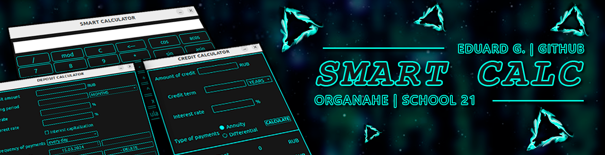
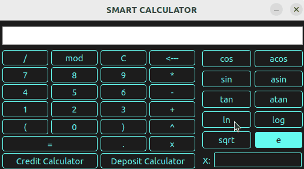
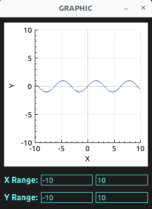
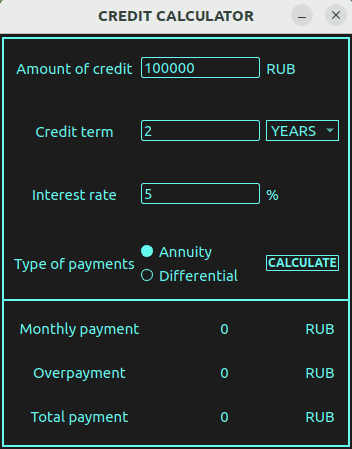
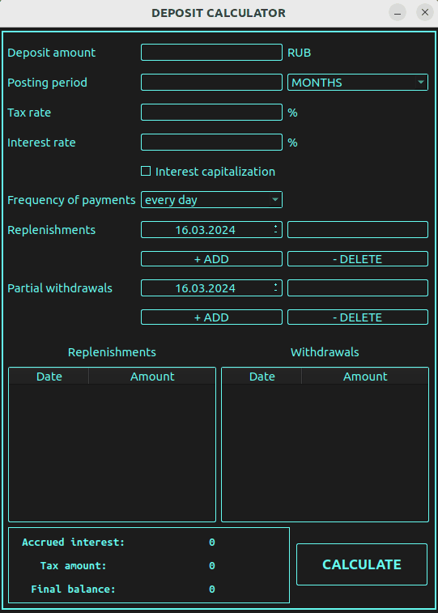

# SmartCalc v2.0

**SmartCalc v2.0** — это не просто калькулятор. Это мощный инструмент для анализа и визуализации математических функций, разработанный на C++ 17 в рамках учебной программы "Школа 21". SmartCalc v2.0 превосходит стандартные калькуляторы, предлагая пользователям расширенные возможности для работы с математическими выражениями.

## Содержание

- [Особенности](#особенности)
- [Обзор Калькулятора](#обзор-калькулятора)
- [Техническое Задание](#техническое-задание)
  - [Основное задание](#основное-задание-реализация-smartcalc-v20)
  - [Кредитный калькулятор](#первое-дополнительное-задание-кредитный-калькулятор)
  - [Депозитный калькулятор](#второе-дополнительное-задание-депозитный-калькулятор)
- [Установка](#установка)
- [Недостатки и планы по улучшению](#недостатки-программы)

## Особенности

- **Архитектура MVC**: Обеспечивает гибкость и расширяемость.
- **Поддержка математических функций**: Включая синус, косинус, логарифм и многое другое.
- **Вычисление с меременными**: Возможность использования переменной `x` для функций и графиков.
- **Дополнительные модули**: Кредитный и депозитный калькуляторы для финансового анализа.

## Обзор Калькулятора

### Основные Вычисления

SmartCalc v2.0 позволяет выполнять стандартные арифметические операции с учетом приоритетов, а также расширенные вычисления с использованием математических функций.

### График Функций

Визуализируйте функции, как показано на примере `sin(x)`. Графики снабжены координатными осями и адаптивной сеткой.

### Кредитный Калькулятор

Помогает рассчитать ежемесячные платежи, переплату и общую сумму по кредиту.

### Депозитный Калькулятор

Рассчитайте доходность вкладов с учетом налогов, капитализации процентов и других параметров.

## Установка

**Требования**: Установленные `gcc`, `make` и `qmake`.

### Цели MAKEFILE:
- **install** \
    Устанавливает калькулятор в папку build.

- **uninstall** \
    Удаляет калькулятор.

- **dvi** \
    Открывает документацию по проекту.

- **dist** \
    Генерирует дистрибутив .tgz с исполняемым файлом и необходимой документацией.

- **test** \
    Запуск тестирования модулей калькулятора.

- **gcov_report** \
    Генерирует html отчет с отображением покрытия всех функций тестами.

- **valgrind** \
    Инициализирует проверку проекта с помощью valgrind.

## Техническое задание

### Основное задание. Реализация SmartCalc v2.0

Мне необходимо было реализовать SmartCalc v2.0:

- Программа должна быть разработана на языке C++ стандарта C++17;
- При написании кода необходимо придерживаться Google Style;
- Классы должны быть реализованы внутри пространства имен `s21`;
- Необходимо подготовить полное покрытие unit-тестами модулей, связанных с вычислением выражений, c помощью библиотеки GTest;
- Сборка программы должна быть настроена с помощью Makefile со стандартным набором целей для GNU-программ: all, install, uninstall, clean, dvi, dist, tests. Установка должна вестись в любой другой произвольный каталог;
- Реализация с графическим пользовательским интерфейсом, на базе любой GUI-библиотеки с API для C++17.
- Программа должна быть реализована с использованием паттерна MVC, а также:
    - не должно быть кода бизнес-логики в коде представлений;
    - не должно быть кода интерфейса в контроллере и в модели;
    - контроллеры должны быть тонкими;
- На вход программы могут подаваться как целые числа, так и вещественные числа, записанные и через точку, и в экспоненциальной форме записи;
- Вычисление должно производиться после полного ввода вычисляемого выражения и нажатия на символ `=`;
- Вычисление произвольных скобочных арифметических выражений в инфиксной нотации;
- Вычисление произвольных скобочных арифметических выражений в инфиксной нотации с подстановкой значения переменной _x_ в виде числа;
- Построение графика функции, заданной с помощью выражения в инфиксной нотации с переменной _x_  (с координатными осями, отметкой используемого масштаба и сеткой с адаптивным шагом);
    - Не требуется предоставлять пользователю возможность менять масштаб;
- Область определения и область значения функций ограничиваются по крайней мере числами от -1000000 до 1000000;
    - Для построения графиков функции необходимо дополнительно указывать отображаемые область определения и область значения;
- У пользователя должна быть возможность ввода до 255 символов;
- Скобочные арифметические выражения в инфиксной нотации должны поддерживать следующие арифметические операции и математические функции:
    - **Арифметические операторы**:

        | Название оператора | Инфиксная нотация   (Классическая) | Префиксная нотация   (Польская нотация) |  Постфиксная нотация   (Обратная польская нотация) |
        | ------ | ------ | ------ | ------ |
        | Скобки | (a + b) | (+ a b) | a b + |
        | Сложение | a + b | + a b | a b + |
        | Вычитание | a - b | - a b | a b - |
        | Умножение | a * b | * a b | a b * |
        | Деление | a / b | / a b | a b \ |
        | Возведение в степень | a ^ b | ^ a b | a b ^ |
        | Остаток от деления | a mod b | mod a b | a b mod |
        | Унарный плюс | +a | +a | a+ |
        | Унарный минус | -a | -a | a- |

        >Обрати внимание, что оператор умножения содержит обязательный знак `*`. Обработка выражения с опущенным знаком `*` является необязательной и остается на усмотрение разработчика.

    - **Функции**:
  
        | Описание функции | Функция |   
        | ---------------- | ------- |  
        | Вычисляет косинус | cos(x) |   
        | Вычисляет синус | sin(x) |  
        | Вычисляет тангенс | tan(x) |  
        | Вычисляет арккосинус | acos(x) | 
        | Вычисляет арксинус | asin(x) | 
        | Вычисляет арктангенс | atan(x) |
        | Вычисляет квадратный корень | sqrt(x) |
        | Вычисляет натуральный логарифм | ln(x) | 
        | Вычисляет десятичный логарифм | log(x) |

### Первое дополнительное задание. Кредитный калькулятор

Предусмотреть специальный режим «кредитный калькулятор» (за образец можно взять сайты banki.ru и calcus.ru):
 - Вход: общая сумма кредита, срок, процентная ставка, тип (аннуитетный, дифференцированный);
 - Выход: ежемесячный платеж, переплата по кредиту, общая выплата.

### Второе дополнительное задание. Депозитный калькулятор

Предусмотреть специальный режим «калькулятор доходности вкладов» (за образец можно взять сайты banki.ru и calcus.ru):
 - Вход: сумма вклада, срок размещения, процентная ставка, налоговая ставка, периодичность выплат, капитализация процентов, список пополнений, список частичных снятий;
 - Выход: начисленные проценты, сумма налога, сумма на вкладе к концу срока.

## Недостатки программы

В процессе разработки были выявлены и запланированы к улучшению следующие аспекты:

- Добавить больше вариаций ошибок, чтобы точнее иметь представление о причине неполадки.
- Изменить поиск ошибок в вводимом выражении в польской нотации.
- Пересмотреть политику наименования файлов в соответствии с их назначением согласно MVC паттерну.
- Переделать польскую нотацию более простым способом.
- Исправить некоторые условия которые, по моему мнению, слишком велики.
- Найти более простой подход по вычислению дохода с вкладов учитывая список пополнений и список снятий.

Изначально польская нотация не делалась как отдельный класс. К преобразованию я пришёл из-за паттерна MVC, где удобнее использовать классы, поэтому не используются приватные переменные, с которыми было бы всё легче, но переделывать планирую только в будущем.

Я знаю, что этот код можно написать в разы проще, но это познаёшь только при написании, а переписывать обучающий проект отложил на потом, т.к. нужный опыт получен, а вернуться к нему я смогу в любое время.

В будущем планирую снова заглянуть в код этого проекта, чтобы посмотреть свежим и более опытным взглядом.